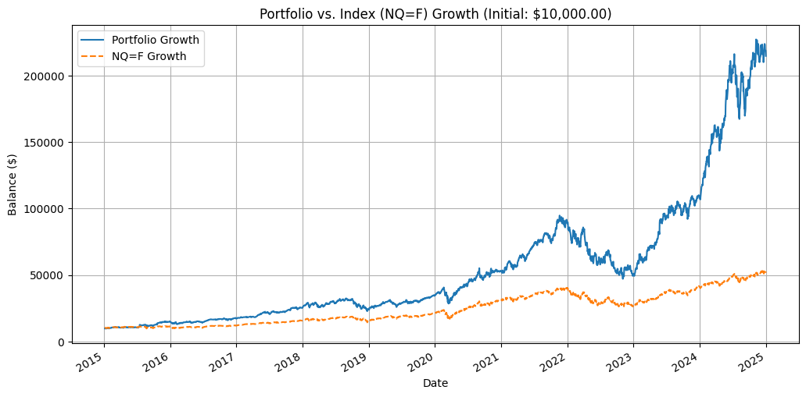

# 📈 Quantitative Portfolio Performance Simulation and Analysis

---

This repository hosts a robust **Python simulation** designed to quantitatively backtest the performance of a custom-defined stock portfolio against a major market index over a specified historical period.

The portfolio's asset allocation—defined by the stock tickers and their corresponding weights—is sourced directly from a data-driven **Optimal Portfolio Allocation** model developed in a prior project: **[handiko/Optimal-Portfolio-Allocation](https://github.com/handiko/Optimal-Portfolio-Allocation)**.

This project focuses on the **technical execution** of the simulation, robust data reconciliation, and the computation of key, annualized performance metrics, providing a comprehensive quantitative comparison.

---

## 🛠️ Technical Overview and Methodology
### 1. Data Acquisition and Preprocessing

The simulation leverages the **`yfinance`** library for fetching historical market data, specifically adjusted daily closing prices.

* **Data Source:** Adjusted daily closing prices are downloaded for the specified portfolio constituents (e.g., `META`, `MSFT`, `NVDA`, etc.) and the chosen **Comparison Index** (e.g., `NQ=F`).
* **Time Horizon:** The simulation is configured for a **lump-sum investment** over a customizable lookback period (default is 10 years ending on a specified `END_DATE`).
* **Data Alignment:** A critical step is the **reconciliation and alignment** of the daily returns. Daily returns for all individual stocks and the comparison index are calculated, and then both series are intersected (`common_index`) to ensure they cover the **exact same set of trading days**. This guarantees a fair, like-for-like performance comparison.

### 2. Portfolio and Index Return Calculation
#### Portfolio Returns:
The simulation assumes a **buy-and-hold** strategy based on the initial allocation (no rebalancing). The daily portfolio return ($\text{Return}_p$) is calculated as a **weighted sum** of the individual stock daily returns ($\text{Return}_i$):

$$
\text{Return}_p = \sum_{i=1}^{N} (w_i \times \text{Return}_i)
$$

Where $w_i$ is the fixed capital weight of stock $i$.

#### Balance Growth Calculation:
The portfolio balance growth reflects how an `INITIAL_CAPITAL` (e.g., \$10,000) would have grown over the period:

1.  **Individual Stock Growth:** The cumulative return ($C_i$) for each stock is computed from its daily returns.
2.  **Portfolio Balance:** The total value is the sum of the initial capital allocated to each stock multiplied by its cumulative return:
    $$
    \text{Balance}_p = \sum_{i=1}^{N} (w_i \times \text{Initial Capital} \times C_i)
    $$
3.  **Index Balance:** The comparison index's cumulative growth is scaled by the `INITIAL_CAPITAL` to match the portfolio's starting value for the visual comparison.

### 3. Quantitative Performance Metrics (Annualized)

| Metric | Description | Formula Highlights |
| :--- | :--- | :--- |
| **Sharpe Ratio** | Risk-adjusted return for unit of **total volatility**. | $\frac{\text{Mean}(\text{Excess Returns})}{\text{StdDev}(\text{Excess Returns})} \times \sqrt{252}$ |
| **Sortino Ratio** | Risk-adjusted return focusing only on **downside volatility** (returns below $\text{Daily RFR}$). | $\frac{\text{Mean}(\text{Returns}) - \text{Daily RFR}}{\text{StdDev}(\text{Downside Returns})} \times \sqrt{252}$ |
| **Calmar Ratio** | Measures return (Compound Annual Growth Rate, CAGR) relative to **Maximum Drawdown (MDD)**. | $\frac{\text{CAGR}}{\|\text{Max Drawdown}\|}$ |
| **Max Drawdown (MDD)** | The largest peak-to-trough decline over the entire period. | $\min\left(\frac{\text{Cumulative Wealth}}{\text{Peak Cumulative Wealth}}\right) - 1$ |

---

## 🚀 Getting Started

To run this backtesting simulation, you will need to install the core dependencies:

```bash
pip install yfinance pandas numpy matplotlib tabulate
```

## Results

Portfolio performance against the Nasdaq Index (NQ=F)

```bash
======================================================================
Simulation Period: 2015-01-06 to 2024-12-31
Initial Investment: $10,000.00
======================================================================
| Metric        | Portfolio   | NQ=F       |
|:--------------|:------------|:-----------|
| Final Balance | $214,683.16 | $51,700.87 |
| Total Return  | 2046.83%    | 417.01%    |
| Sharpe Ratio  | 0.9722      | 0.7663     |
| Sortino Ratio | 1.3027      | 0.9774     |
| Calmar Ratio  | 0.5859      | 0.5031     |

```

Portfolio performance chart:


---

Related Project: [Multi-Criteria Optimal Portfolio Allocation using Monte Carlo](https://github.com/handiko/Optimal-Portfolio-Allocation/blob/main/README.md)

---

Back to [Index](https://github.com/handiko/handiko/blob/master/README.md)
